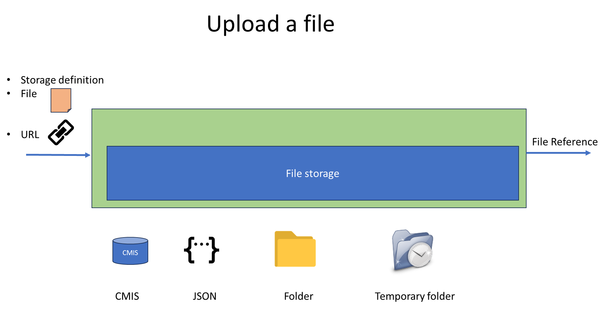

# camunda-8-connector-filestorage
Connector to upload, download, delete file in a filestorage repository

Camunda 8 does not manage file, only small data.

The filestorage library is a solution to manipulate file. it use the library https://github.com/camunda-community-hub/zebee-filestorage

Multiple connectors https://github.com/camunda-community-hub/camunda-8-connector-officetopdf,  https://github.com/camunda-community-hub/camunda-8-connector-pdf 
use this library to manipulate file

This container offer different function:
* upload a file in the storage, from a local disk or from an URL
* download a file from the storage to the local disk
* delete a file in the storage

The first parameter give the function (upload, download, delete). Other depends of the function

# Upload

Upload a file to the Storage.
A file is read locally, or from an URL, and is loaded in the file storage.
The Storage definition give information on the Storage.

## Principle
A file is read locally, or from an URL, and is loaded in the file storage.
The Storage definition give information on the Storage.

## Inputs
| Name                          | Description                   | Class            | Default | Level     |
|-------------------------------|-------------------------------|------------------|---------|-----------|
| sourceFile                    | File reference                | java.lang.Object |         | REQUIRED  |
| extractExpression             | Expression (1)                | java.lang.String |         | REQUIRED  | 
| destinationFileName           | Name of the destination file  | Java.lang.String |         | REQUIRED  |
| destinationStorageDefinition  | Storage definition (2)        | Java.lang.String |         | REQUIRED  |

(1) the expression is a sequence of intervals. An interval is a page number or two pages separated by a -.
The unique character "n" indicates the last page of the document.
The first page is named 1

For example:
* "5" extract page number 5
* "5,8" extract pages 5 and 8. The result will have two pages
* "3-4, 8-12, 15" extract pages 3,4,8,9,10,11,12,15
* "6-8, 11-n" extract pages 6,7,8, then page 11 and pages after 11 until the end of the document.

(2) the storage definition indicates where the document must be saved. It is different
storage definition usable (TEMPFOLDER, FOLDER, CMIS).
If no value is given, then the storage definition of the source file is used.

## Output
| Name             | Description                     | Class            | Level    |
|------------------|---------------------------------|------------------|----------|
| destinationFile  | Reference to the file produced  | java.lang.String | REQUIRED |

## BPMN Errors

| Name                                     | Explanation                                                                                                                                      |
|------------------------------------------|--------------------------------------------------------------------------------------------------------------------------------------------------|
| LOAD_ERROR                               | An error occurs during the load                                                                                                                   |
| LOAD_DOCSOURCE                           | The reference can't be decoded                                                                                                                   |
| BAD_STORAGE_DEFINITION                   | The storage definition does not correctly describe |
| NO_DESTINATION_STORAGE_DEFINITION_DEFINE | A storage definition must be set to store the result document                                                                                    |
| LOAD_PDF_ERROR                           | Error reading the document - is that a PDF?                                                                                                      |
| ENCRYPTED_PDF_NOT_SUPPORTED              | Encrypted PDF is not supported                                                                                                                   |
| ERROR_CREATE_FILEVARIABLE                | Error when reading the PDF to create a fileVariable to save                                                                                      |
| SAVE_ERROR                               | An error occurs during the save                                                                                                                  |
| INVALID_EXPRESSION                       | Invalid expression to pilot the extraction. Format must be <number1>-<number2> where number1<=number2. n means 'end of document' : example, 10-n |
| EXTRACTION_ERROR                         | Extraction error                                                                                                                                 |

