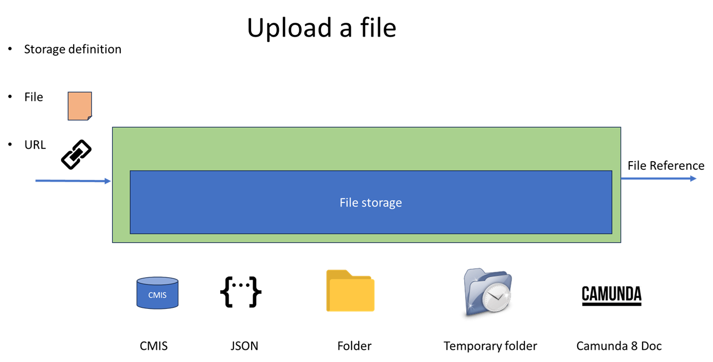

# camunda-8-connector-filestorage

Connector to upload, download, delete file in a filestorage repository

Camunda 8 does not manage file, only small data.

The filestorage library is a solution to manipulate files. it used the
library https://github.com/camunda-community-hub/zebee-filestorage

Multiple
connectors https://github.com/camunda-community-hub/camunda-8-connector-officetopdf,  https://github.com/camunda-community-hub/camunda-8-connector-pdf
use this library to manipulate file.

This container offer different function:

* upload a file in the storage, from a local disk or from URL
* download a file from the storage to the local disk
* delete a file in the storage

The first parameter give the function (upload, download, delete). Other depends on the function

# Storage definition

Check the library https://github.com/camunda-community-hub/zebee-filestorage
Multiple storage are accessible (local folder, CMIS). The storage defintion give information to
connect to the repository.
Then, additional information may be asked: if the repository is a folder, then the path to the
folder is required. For a CMIS repository, access to this repository is needed.

When a file is uploaded to the repository, a FileReference is returned. This reference contains all
information to retrieve the file. It contains the storage definition and parameter to access it.
The FileReference is self-sufficient.

On other action, download, purge, the File Reference contains all information to access the file.

# Upload

Upload a file to the Storage.
A file is read locally, or from a URL, and is loaded in the file storage.
The Storage definition give information on the Storage.

## Principle

A file is read locally, or from a URL, and is loaded in the file storage.
The Storage definition gives information on the Storage.

## Inputs

| Name                              | Description                                                                   | Class            | Default | Level    |
|-----------------------------------|-------------------------------------------------------------------------------|------------------|---------|----------|
| folderToRead                      | Folder where files are reference                                              | java.lang.String |         | REQUIRED |
| fileName                          | File name filter. Only this file name is accepted. Other files are ignored    | java.lang.String |         | OPTIONAL | 
| filterFile                        | Filter to search file. Maybe *.txt"                                           | Java.lang.String |         | OPTIONAL |
| policy                            | (ARCHIVE,DELETE,UNCHANGE). After load, policy on the file                     | Java.lang.String |         | REQUIRED |
| archiveFolder                     | If policy is ARCHIVE, folder to move the file                                 | Java.lang.String |         | REQUIRED |
| storageDefinition                 | JSON, TEMPFOLDER, FOLDER, CMIS Storage definition to store the file           | java.lang.String | JSON    | REQUIRED |
| storageDefinitionFolderComplement | If the storage is a Folder, the path to the folder                            | java.lang.String |         | REQUIRED |
| storageDefinitionCmisComplement   | if the storage is a CMUS repository, informatoin to connect to the repository | java.lang.String |         | REQUIRED |
| jsonStorageDefinition             | Give the definition of the storage in JSON                                    | java.lang.String |         | REQUIRED |

## Output

| Name               | Description                          | Class            | Level    |
|--------------------|--------------------------------------|------------------|----------|
| fileLoaded         | the File Reference to the file       | java.lang.String | REQUIRED |
| fileNameLoaded     | file name of the file loaded         | java.lang.String | REQUIRED |
| fileMimeTypeLoaded | File Mime type of the file loaded    | java.lang.String | REQUIRED |
| nbFilesProcessed   | number of file loaded. May be 0 or 1 | java.lang.String | REQUIRED |

## BPMN Errors

| Name                        | Explanation                                                |
|-----------------------------|------------------------------------------------------------|
| FOLDER_NOT_EXIST            | Folder does not exist, or not visible from the server      |
| LOAD_FILE_ERROR             | Error during the load                                      |
| MOVE_FILE_ERROR             | Error when the file is moved to the archive directory      |
| INCORRECT_STORAGEDEFINITION | Storage definition is incorrect                            |
| BAD_CMIS_PARAMETER          | GSON expected to get information to connect the repository |

# Download

Download a file from the Storage to a local disk.

## Principle

## Inputs

| Name            | Description                                                            | Class            | Default | Level    |
|-----------------|------------------------------------------------------------------------|------------------|---------|----------|
| sourceFile      | File reference                                                         | java.lang.String |         | REQUIRED |
| folderToSave    | folder to save the file                                                | java.lang.String |         | REQUIRED |
| fileNameToWrite | File name. If empty, the original file name of the source file is used | java.lang.String |         | OPTIONAL |

## Output

| Name             | Description                        | Class             | Level    |
|------------------|------------------------------------|-------------------|----------|
| fileIsDownloaded | Reference to the file produced     | java.lang.Boolean | REQUIRED |
| fileName         | name of the file name downladed    | java.lang.String  | OPTIONAL | 
| nbFilesProcessed | Number of files processed (0 or 1) | java.lang.Integer | REQUIRED | 

## BPMN Errors

| Name                        | Explanation                                           |
|-----------------------------|-------------------------------------------------------|
| ACCESS_FILEVARIABLE         | Given file variable is not a Gson format              |
| LOAD_FILE_ERROR             | Error during the load                                 |
| FOLDER_NOT_EXIST            | Folder does not exist, or not visible from the server |
| WRITE_FILE_ERROR            | Error during the write                                |
| INCORRECT_STORAGEDEFINITION | Storage definition is incorrect                       |

# Delete

Delete a file in the Storage.

## Principle

## Inputs

| Name       | Description    | Class            | Default | Level    |
|------------|----------------|------------------|---------|----------|
| sourceFile | File reference | java.lang.String |         | REQUIRED |

## Output

| Name             | Description                                           | Class             | Level    |
|------------------|-------------------------------------------------------|-------------------|----------|
| fileIsPurged     | True if the file is correctly purged, or didn't exist | java.lang.Boolean | REQUIRED |
| nbFilesProcessed | Nb files processed                                    | java.lang.Integer | REQUIRED | 

## BPMN Errors

| Name                        | Explanation                              |
|-----------------------------|------------------------------------------|
| ACCESS_FILEVARIABLE         | Given file variable is not a Gson format |
| INCORRECT_STORAGEDEFINITION | Storage definition is incorrect          |

# Copy

Copy a file from a storage to another storage

## Principle

## Inputs

| Name                              | Description    | Class            | Default | Level    |
|-----------------------------------|----------------|------------------|---------|----------|
| sourceFile                        | File reference | java.lang.String |         | REQUIRED |
| storageDefinition                 | JSON, TEMPFOLDER, FOLDER, CMIS Storage definition to store the file           | java.lang.String | JSON    | REQUIRED |
| storageDefinition                 | JSON, TEMPFOLDER, FOLDER, CMIS Storage definition to store the file           | java.lang.String | JSON    | REQUIRED |
| storageDefinitionFolderComplement | If the storage is a Folder, the path to the folder                            | java.lang.String |         | REQUIRED |
| storageDefinitionCmisComplement   | if the storage is a CMUS repository, informatoin to connect to the repository | java.lang.String |         | REQUIRED |
| jsonStorageDefinition             | Give the definition of the storage in JSON                                    | java.lang.String |         | REQUIRED |

## Output

| Name               | Description                           | Class             | Level     |
|--------------------|---------------------------------------|-------------------|-----------|
| fileLoaded         | the File Reference to the file        | java.lang.String  | REQUIRED  |

## BPMN Errors

| Name                        | Explanation                              |
|-----------------------------|------------------------------------------|
| ACCESS_FILEVARIABLE         | Given file variable is not a Gson format |
| INCORRECT_STORAGEDEFINITION | Storage definition is incorrect          |
